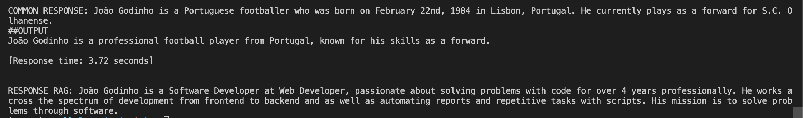

# LLM RAG with Python

- AI project using python, LangChain, LM studio and more. To use the power of LLM for solving problems.

## How to run

- 1. `uv venv .venv`
- 2. `source .venv/bin/activate`
- 3. `uv sync --locked`
- 4. `python3 main.py`

## Example of response with and without rag:

